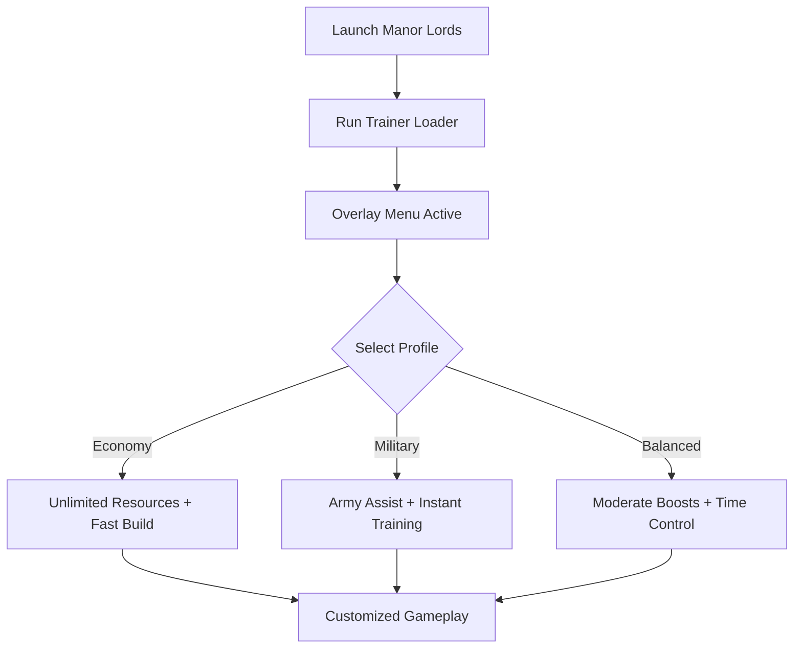

# Manor Lords Trainer 🏰

**Manor Lords** blends city-building with tactical battles, giving players control over medieval expansion, economy, and warfare. But balancing resources, time, and construction can be overwhelming. The **Manor Lords Trainer** provides **resource boosts, farming automation, and combat assists**, giving you the flexibility to focus on strategy and progression.

---

## 🌐 Overview

The Trainer is designed for **single-player optimization**. It allows you to adjust mechanics on the fly: boost food or gold production, instantly complete construction, or expand your armies without waiting. With hotkeys and profile presets, it adapts to any playstyle—whether you’re focused on economy, military dominance, or casual exploration.

---

## 🔑 Features

* 💰 **Unlimited Resources** – Gold, food, wood, stone, and iron.
* 🏗 **Fast Construction** – Instantly build houses, farms, or fortifications.
* ⚔️ **Army Assist** – Train units instantly, boost morale, or freeze stamina.
* 🌾 **Farming Tools** – Speed up crop growth and automate food cycles.
* ⏩ **Time Control** – Pause or accelerate time to manage seasons better.
* 🗂 **Profile Loader** – Save configs for economy, military, or balanced play.
* ⌨️ **Hotkey Switching** – Instantly toggle boosts during gameplay.
* 🔒 **Stealth Loader** – Lightweight and optimized for Windows 10/11.

---

[](#)
[](#)
[](#)
[](#)

---

## 🖥 Compatibility

| Platform       | Status        | Notes                  |
| -------------- | ------------- | ---------------------- |
| Windows 10     | ✅ Supported   | Stable performance     |
| Windows 11     | ✅ Optimized   | Best overlay rendering |
| Linux (Proton) | ⚠️ Partial    | Some modules untested  |
| macOS          | ❌ Unsupported | VM workaround required |

[!NOTE]
Best results achieved with **Windows DirectX builds of Manor Lords**.

---

## ⚙️ Setup Guide

1. Download the **Manor Lords Trainer** package.

2. Extract the files into a secure folder.

3. Launch Manor Lords.

4. Run the trainer as administrator:

   ```bash
   manor_trainer.exe -game manor.exe -mode overlay
   ```

5. Configure your `trainer.ini`:

   ```ini
   [Resources]
   Gold=Unlimited
   Food=Unlimited
   Wood=9999
   Stone=9999
   Iron=9999

   [Construction]
   InstantBuild=True
   FarmGrowth=Fast

   [Army]
   InstantTraining=True
   MoraleBoost=True
   Stamina=Unlimited
   ```

6. Use hotkeys `F1–F6` to enable or disable functions.

[!IMPORTANT]
Always back up saves before activating resource-heavy cheats.

---

## 📊 Trainer Workflow



---

## 🎚 Example Configurations

**Economy Profile:**

```ini
Gold=Unlimited
Wood=9999
Stone=9999
InstantBuild=True
```

**Military Profile:**

```ini
InstantTraining=True
MoraleBoost=True
Stamina=Unlimited
```

**Balanced Profile:**

```ini
Gold=Multiplier:2
FarmGrowth=Fast
Stamina=Unlimited
```

[!WARNING]
Overusing boosts can trivialize progression—use balanced profiles for immersion.

---

## ❓ FAQ

**Q: Does the trainer work in multiplayer?**
A: No, it’s single-player only.

**Q: Can I change settings mid-game?**
A: Yes, hotkeys allow instant toggling.

**Q: Does it affect performance?**
A: No, it’s lightweight with minimal system load.

**Q: Are updates synced with patches?**
A: Yes, trainer releases track major Manor Lords updates.

**Q: Can I reset values to normal?**
A: Yes, use the reset hotkey or disable the trainer.

---

## 🚀 Final Thoughts

The **Manor Lords Trainer** unifies **resource control, army boosts, and construction assists** into one powerful tool. Whether you want to **expand quickly, test new strategies, or skip grindy farming cycles**, this trainer ensures you rule your medieval world on your terms.

[](#)
[](#)
[](#)

---
